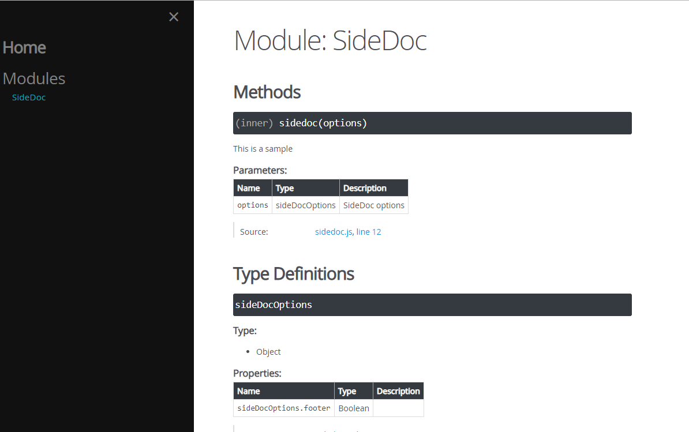
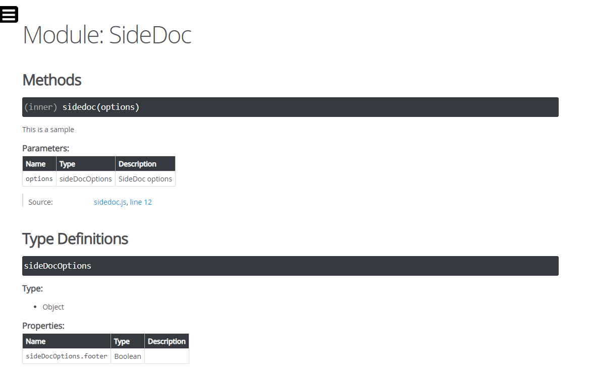
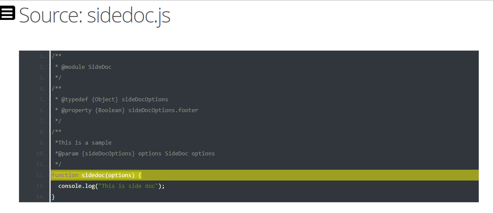

## Usage
In your jsdoc config file, just set the template in `opts` to `node_modules/sidedoc` 

```
 "opts": {
    "encoding": "utf8",
    "destination": "./doc/",
    "template": "node_modules/sidedoc",
    "tutorials": "./tutorials",
    "recurse": true
  }

```
## Screenshot 1


## Screenshot 2


## Screenshot 3

